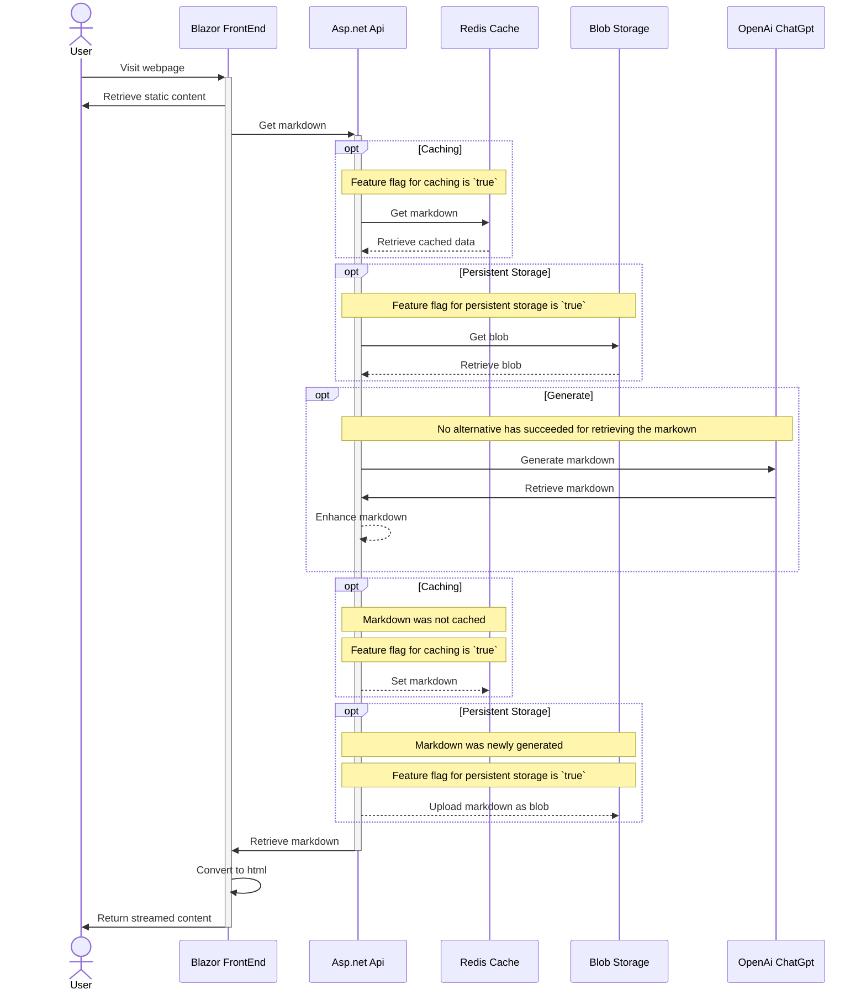

# Digital Twin Docs

A web application that effortlessly creates a digital twin documentation environment for your company.

Using a company name and a brief description, this project will generate a page with internal documentation to be used by employees and contractors. Every page might include links to other valuable topics, allowing you to dive deeper into specific subjects and potentially generate an infinite amount of information!

## Technologies

Some cool technologies used in this project:
- .NET 8.0
- Aspire ✨
- Minimal APIs
- Native AOT
- Blazor
- Feature Management
- OpenAI/ChatGPT
- Redis Caching
- Blob Storage

## Sequence chart

## How to use

A short description on how to quickly get up and running after downloading the project.

Requirements:
- Visual Studio 17.9 
- Aspire compontent
- Docker Desktop
- OpenAi account
    - Make note of the api key and uri
- Azure Storage Account[^1]
    - A container named `Markdown`
    - Make note of the access key
- Update all `appsettings.json` files with your information
    - Feature flag `Cache` allows you to cache results to a Redis cache
    - Feature flag `PersistentStorage` allows you to store results to an Azure Blob storage

[^1]: Only required when you use the `PersistentStorage` flag.
